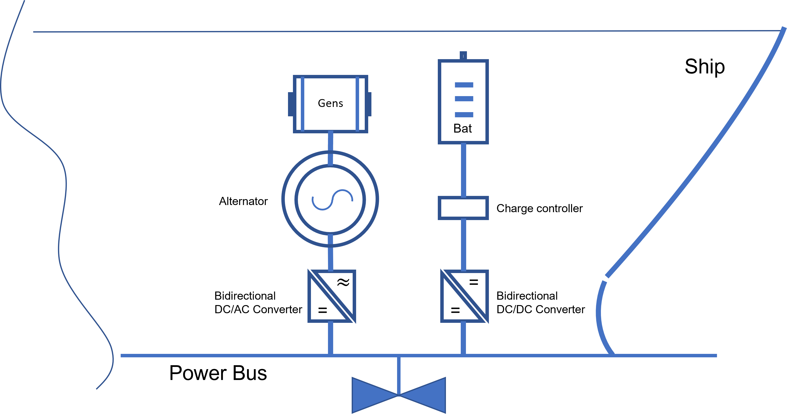

Project overview.
====================

### HEO Model - Genset(s) and Baterie(s)

This project seeks to utilize a genset optimally by introducing an energy storage in the form of a battery to let the genset run at optimal load over a predefined time horizon. The primary example is built around an offshore shipping example, but the general setup extrapolates to any setting where there are one or more energy produces whose fuel efficiency varies with the load.

### Model synopsys
- The model developed is of Mixed Integer Linear Programming (MILP)
type. All functions (objective and constraints) are linear and the variables can be continuous, integer or binary. Binary variables are used to model logical decisions in the problem (i.e. a generator is used = 1 or not used =o).
- The optimal solution to the MILP problem is found by solving a sequence of
many LP problems (simpler problems that are solved very fast), where the number of LP problems to solve depends on the number of binary and integer variables (more variables gives a larger combinatorial solution space).
- Nonlinear functions can in many cases be approximated with piecewise linear ones, meaning that the MILP approach is quite general. 
- There exist state-of-the-art MILP solvers on the market that are highly efficient and capable of solving even very "large" MILP problems.

### Model optimization policy
- The optimization model is done in discrete time, i.e. the time horizon is divided into smaller time steps (for example 1 minute) and in each time step everything is kept constant.
- The objective is to minimize fuel consumption within the time horizon given a pre-defined load shedule for each time step.
- Logical variables are introduced to facilitate the logic necessary for operating gensets and batteries.
- The model is generic and easy to adjust and scale up.

### Problem size
We need to know the problem size in order to see if the problem is computationaly cost effective or not, our problem size is mainly dependant on the size of the load window time frame (aka : steps ${n}$ ), the number of LP variables and the number of gensets ${m}$ (we use 1 genset in our case). 

- Continuous : $\hspace{3cm}\hspace{1cm} {3} \cdot {n} \cdot {m}$    
- Binary : $\hspace{4cm}\hspace{1cm} {2} \cdot {n} \cdot {m}$   

- Number of constraints : $\hspace{1cm}\hspace{1cm} {7} \cdot {n} \cdot {m} + {3} \cdot {n}$ $\hspace{1cm}$ 