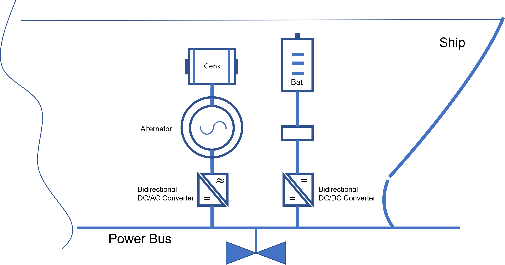

Project study case.
====================

### 1Gen-1Bat.

This particular case is initially specefic for the offshore shipping industry as they are the most transportation fuel consuming and needing some sort of solutions to use fuel optimally in their trips. However this is not only exlusive to this sector, it can be easily extended to other sectors as long as the purpose is to optimize energy usage and energy hybridization using only one genset and one battery storage system (1Gen-1Bat for short).

### Model synopsys.

- The model developed is of Mixed Integer Linear Programming (MILP)
type. All functions (objective and constraints) are linear and the variables can be continuous, integer or binary. Binary variables are used to model logical decisions in the problem (i.e. a generator is used = 1 or not used =o).

- The optimal solution to MILP problem is found by solving a sequence of
many LP problems (simpler problems that are solved very fast) Binary and integer variables increases the combinatorial solution space.

- 0The number of problems to solve is determined roughly by the number of binary variables. The combinatorial space can be reduced by constraints limiting impossible combinations.

- Nonlinear functions can in many cases be approximated with piecewise linear ones. So the MILP approach is quite general.There are also state-of-the-art MILP solvers on the market that are highly efficient and capable of solving "large" MILP problems.

### Model optimization policy. 

- The optimization model is done in discrete time, i.e. the timeline is divided into smaller time steps (for example 1 minute) and in each time step everything is kept constant.

- The objective is to minimize fuel consumption during a trip with pre-defined power requirements in each time step.

- Logical variables are introduced, so it is possible to include any logic necessary in operating gensets and battery.
- The model is generic and easy to adjust and also possible to scale up.