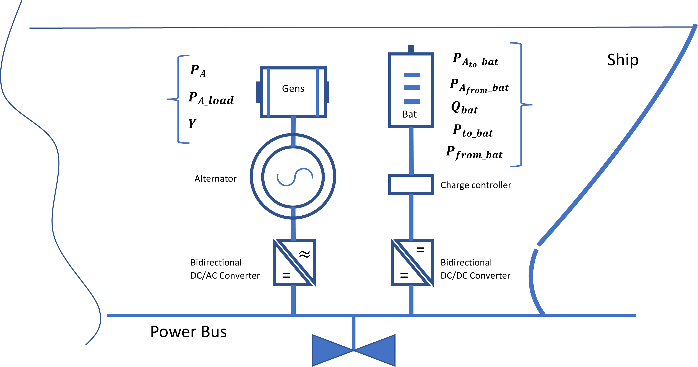

Variables bounds.
====================
Linear programing (LP) variables are the variables whose values the optimizer will solve for in each time step. 

#### Upper and lower bounds:
---
| LPvariable                    | Lower bound                                      | Upper bound
| ------------------------      | --------------                                   | --------
| $Q_{bat}{k}$                  | $0\ldotp 2.Q_{\mathrm{max}}$                     | $Q_{\mathrm{max}}$
| $P_{k}$                       | 0                                                | $0.9.P_{\mathrm{min}}$
| $P_{\mathrm{load}, k}$        | 0                                                | $0.9.P_{\mathrm{max}}$
| $P_{\mathrm{to~bat}, k}$      | 0                                                | $0.9.P_{\mathrm{max}}$
| $P_{\mathrm{from~bat}, k}$    | 0                                                | $0.9.P_{\mathrm{max}}$
| $Y_k$                         | 0                                                | 1
| $Y_{\mathrm{to~bat}}$         | 0                                                | 1
| $Y_{\mathrm{from~~bat}}$      | 0                                                | 1
| $Z$                           | 0                                                | 1
| $FOC$                         | 0                                                | $Max_{FC}$