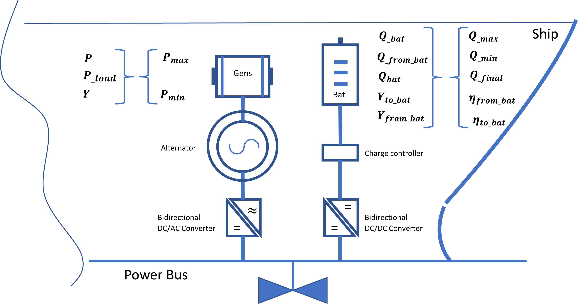

## Problem LP constraints.
---

#### Linear programming constraints

Linear programming constraints (LP constraints) are the rules that gouverne the problem optimization process. They are fondamentally set of equations, they might be either inequality equations ( example : ${a} + {b} \le {c}\,$)   or equality equations  ( example : ${a} + {b} = {c}\,q$) constructed based on the LP variables quantities and problem parameters. (See. Problem LP variables and Problem LP constraints). 

#### Set of problem LP constraints
---

 <strong>Load requirements :</strong>

\begin{flalign*}
\color{black}
& L_k =P_k^{\mathrm{load}} +\eta {\;}^{\mathrm{from\_Bat}} {\cdot \;P}_k^{\mathrm{from\_Bat}}  & \forall\,\,\,\,\,\, k=1,\dots ,n
\end{flalign*}        

 

<strong>Power split :</strong>

\begin{flalign*}
& P_{k\;} =P_k^{\mathrm{load}} {+\;P}_k^{\mathrm{to\_Bat}}\ & \forall\,\,\,\,\,\, k=1,\dots ,n 
\end{flalign*}         

 

<strong>Charge balance constraints :</strong>

\begin{flalign*}
& Q_k =Q_{k-1} +\eta^{\mathrm{to\_Bat}} \cdot \;P_k^{\mathrm{to\_Bat}} \Delta t-\;P_k^{\mathrm{from\_Bat}} \Delta t\\
& Q_0 =Q_{\mathrm{init}}\\
& Q_n =Q_{\mathrm{final}} & \forall\,\,\,\,\,\, k=1,\dots ,n
\end{flalign*}   

 

<strong>Genset constraints :</strong>

\begin{flalign*}
& P_{k\;} \le {0\ldotp 9P}_{\mathrm{max}\;} {\cdot y}_k  & \forall\,\,\,\,\,\, k=1,\dots ,n\\
& P_{k\;} \le {0\ldotp 2P}_{\mathrm{max}\;} {\cdot y}_k\ & \forall\,\,\,\,\,\, k=1,\dots ,n 
\end{flalign*}   

 

<strong>Battery logical constraints :</strong>

\begin{flalign*}
& y_k^{\mathrm{to\_Bat}} +y_{k\;}^{\mathrm{from\_Bat}} \le 1  & \forall\,\,\,\,\,\, k=1,\dots ,n\\
& P_k^{\mathrm{to\_Bat}} \le 0\ldotp 9P_{\mathrm{max}} {\cdot y}_k^{\mathrm{to\_Bat}} & \forall\,\,\,\,\,\, k=1,\dots ,n \\
& P_k^{\mathrm{from\_Bat}} \le 0\ldotp 9P_{\mathrm{max}} {\cdot \;y}_k^{\mathrm{from\_Bat}}  & \forall\,\,\,\,\,\, k=1,\dots ,n
\end{flalign*}    

 

<strong>Fuel consumption :</strong>

\begin{flalign*}
& {FC}_{k\;} ={aP}_{k\;} +b-{fc}_{offset} \cdot \left(1-y_k \right)\  & \forall\,\,\,\,\,\, k=1,\dots ,n
\end{flalign*}

 

<strong>Objective linearization :</strong>

\begin{flalign*}
& z_k \ge y_k -y_{k-1} & \forall\,\,\,\,\,\, k=2,\dots ,n
\end{flalign*}         

 
 