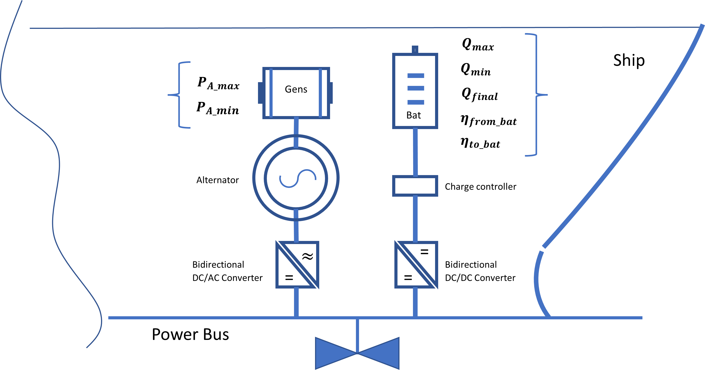

Problem parameters.
=================

#### Optimization parameters.

The optimization parameters are set of paramters that have beeen used along  with this optimization problem. Those are related to power generation, energy charge and discharge, time, and some additional parameters in a mathimatical terminology and cost efficiency. 

#### Set of parameters.

$Q_{\mathrm{max}} \hspace{1cm}$ : Maximal energy charge stored in the battery (kWh)

$Q_{\mathrm{init}} \hspace{1.1cm}$ : Initial energy charge stored in the battery (kWh).

$Q_{\mathrm{final}} \hspace{0.9cm}$ :  Final charge stored in the battery (kWh).

$P_{\mathrm{A_max}\;} \hspace{1cm}$ : Maximal power that can be generated by the genset (kW).

$P_{\mathrm{A_min}\;} \hspace{1cm}$ : Minimal power that can be generated by the genset (kW).

${FC}_{max} \hspace{0.7cm}$ : Maximal fuel consumption (g).

${FC}_{offset} \hspace{0.4cm}$ : Offset for fuel consumption model (at P=0).

$a \hspace{1.7cm}$ : Slope value from the fuel consumption model.

$b \hspace{1.7cm}$ : Intercept value from the fuel consumption model.

$\Delta t \hspace{1.5cm}$ : Time step in discretization (h).

$t_{\mathrm{max}\;} \hspace{1.1cm}$ : Max time in simulation (h).

$n \hspace{1.7cm}$ :  Number of time steps in simulation.

$t \hspace{1.8cm}$ :  Time vector in simulation (dimension(t)=n).

$\eta^{\mathrm{toBat}} \; \hspace{0.9cm}$ :  Efficiency when charging the battery.

$\eta^{\mathrm{fromBat}} \; \hspace{0.5cm}$ :   Efficiency when releasing from the battery.

$L \hspace{1.6cm}$ : Vector of pre-defined load profile (must be of same length as time vector) (kWh).

$\newline$ 

